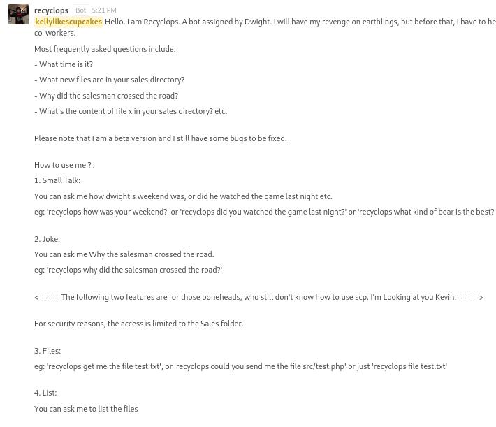
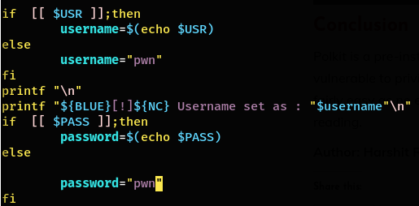

# Hack The Box: Paper
Level: Easy  
Date: 21/05/2022 19:43


## Recon & Enummeration

Nmap shows us the following:

```
Starting Nmap 7.92 ( https://nmap.org ) at 2022-05-21 11:54 EDT
Nmap scan report for 10.10.11.143
Host is up (0.022s latency).
Not shown: 997 closed tcp ports (conn-refused)
PORT    STATE SERVICE  VERSION
22/tcp  open  ssh      OpenSSH 8.0 (protocol 2.0)
| ssh-hostkey: 
|   2048 10:05:ea:50:56:a6:00:cb:1c:9c:93:df:5f:83:e0:64 (RSA)
|   256 58:8c:82:1c:c6:63:2a:83:87:5c:2f:2b:4f:4d:c3:79 (ECDSA)
|_  256 31:78:af:d1:3b:c4:2e:9d:60:4e:eb:5d:03:ec:a0:22 (ED25519)
80/tcp  open  http     Apache httpd 2.4.37 ((centos) OpenSSL/1.1.1k mod_fcgid/2.3.9)
| http-methods: 
|_  Potentially risky methods: TRACE
|_http-title: HTTP Server Test Page powered by CentOS
|_http-generator: HTML Tidy for HTML5 for Linux version 5.7.28
|_http-server-header: Apache/2.4.37 (centos) OpenSSL/1.1.1k mod_fcgid/2.3.9
443/tcp open  ssl/http Apache httpd 2.4.37 ((centos) OpenSSL/1.1.1k mod_fcgid/2.3.9)
|_http-generator: HTML Tidy for HTML5 for Linux version 5.7.28
|_http-title: HTTP Server Test Page powered by CentOS
| http-methods: 
|_  Potentially risky methods: TRACE
|_http-server-header: Apache/2.4.37 (centos) OpenSSL/1.1.1k mod_fcgid/2.3.9
| tls-alpn: 
|_  http/1.1
| ssl-cert: Subject: commonName=localhost.localdomain/organizationName=Unspecified/countryName=US
| Subject Alternative Name: DNS:localhost.localdomain
| Not valid before: 2021-07-03T08:52:34
|_Not valid after:  2022-07-08T10:32:34
|_ssl-date: TLS randomness does not represent time
```

### Port 80
Initally we encounter a plain website with a static start page of Apache running on CentOS.
```
HTTP/1.1 403 Forbidden
Date: Sat, 21 May 2022 17:06:09 GMT
Server: Apache/2.4.37 (centos) OpenSSL/1.1.1k mod_fcgid/2.3.9
X-Backend-Server: office.paper
Last-Modified: Sun, 27 Jun 2021 23:47:13 GMT
ETag: "30c0b-5c5c7fdeec240"
Accept-Ranges: bytes
Content-Length: 199691
Connection: close
Content-Type: text/html; charset=UTF-8

```

Also we come across a domainname: `office.paper`. The webpage seems to be a reference to the TV show "[The Office](https://www.imdb.com/title/tt0386676/)":


#### Wordpress
We run WPScan on the site:

```
...
Interesting Finding(s):

[+] Headers
 | Interesting Entries:
 |  - Server: Apache/2.4.37 (centos) OpenSSL/1.1.1k mod_fcgid/2.3.9
 |  - X-Powered-By: PHP/7.2.24
 |  - X-Backend-Server: office.paper
 | Found By: Headers (Passive Detection)
 | Confidence: 100%

[+] WordPress version 5.2.3 identified (Insecure, released on 2019-09-05).
 | Found By: Rss Generator (Passive Detection)
 |  - http://office.paper/index.php/feed/, <generator>https://wordpress.org/?v=5.2.3</generator>
 |  - http://office.paper/index.php/comments/feed/, <generator>https://wordpress.org/?v=5.2.3</generator>

[+] WordPress theme in use: construction-techup
 | Location: http://office.paper/wp-content/themes/construction-techup/
 | Last Updated: 2021-07-17T00:00:00.000Z
 | Readme: http://office.paper/wp-content/themes/construction-techup/readme.txt
 | [!] The version is out of date, the latest version is 1.4
...


```


We know the site is running wordpress version **5.2.3**, which is vulnerable to [CVE-2019-17671](https://wpscan.com/vulnerability/3413b879-785f-4c9f-aa8a-5a4a1d5e0ba2). This vulnerability allows us to view private or draft posts as an unauthenticated user. We keep this in mind.

#### Browsing the website
Browsing the website we can find a post with a comment from user Nick on a [post](http://office.paper/index.php/2021/06/19/feeling-alone/#comments):


The original posts states user `Prisonmike` is the only user of the blog:


So we know we have to take a look at the drafts within the admin panel, another direct hint to the issue of this site.


## Intitial Foothold

### The Wordpress Drafts

To exploit CVE-2019-17671, we need to append`?static=1` to the base URL. So accessing the URL `http://office.paper/?static=1` we can access Michael's "hidden" notes:


We have obtained a new URL to add to our scope: `http://chat.office.paper/register/8qozr226AhkCHZdyY`


### Dwight's Chatbot
This URL leads us to a registration page of Rocketchat:


After registering we end up with access to a Channel called "General". In this chat we see Jim introduce Dwight's bot. If you watched the show, it's totally a Dwight thing to implement such a thing to be able to socialize less with his coworkers. The bot seems to have some sort wrapped SCP functionality as mentioned in point 3:



We try to interact with the bot. We notice the list command has identical output to the `ls` command. Unfortunately we cannot inject OS commands easily, as that's detected by the bot:


However, directory traversal is possible, which allows us to "list" the home directory:


Apart from other player's exploits and files, we notice the `hubot` directory, which contains the bot's source code. It also contains a file called `.env` containing environment variables:


We can see a pair of credentials for Rocketchat: `recylcops:Queenofblad3s!23`

The actual source code can be found in the `../hubot/scripts` directory:


From the source code of the `cmd.coffee` script, we learn that we can actually run OS commands as user dwight by interacting with the bot with the "cmd" command as follows:


As the webshell is not optimal we manage to establish an SSH connection to the server and re-use the credentials successfully for user `dwight`:


## Privilege Escalation

Now we have obtained access through user *dwight*, we copy linpeas to the machine and execute the following command: `bash linpeas.sh | tee /tmp/peas.txt`

We learn the system is vulnerable to CVE-2021-3560, AKA Polkit.


Polkit seems to be readily available in exploitdb:
We can copy the poc over to our working directory, and host it using Python's built-in webserver as follows:


On the victim machine we download the file, store it as `poc.sh` and modify the username and password to "pwn"




Then, we run the exploit `bash poc.sh`. 


Unfortunately it didn't insert the password directly after the first use. So we had to run the exploit once more. After which we could switch to our new user `pwn` and run sudo commands:

